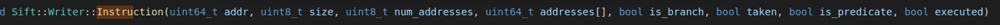
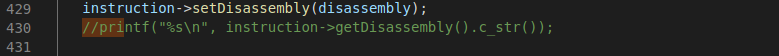
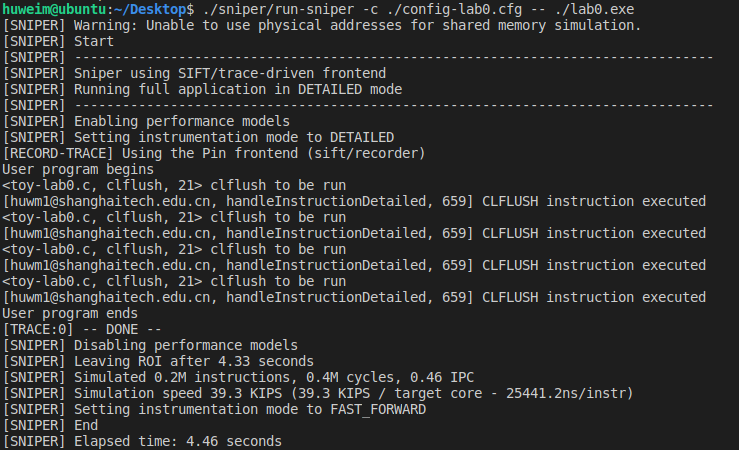

# Lab 0  Summary

##### Name: Hu weiming

##### ID: 2020233177

##### E-mail:huwm1@shanghaitech.edu.cn	

​		

​		After many days of code research and many twists and turns, I finally got the required result with a "stupid" method. Let me talk about the result first, and finally modify the *handleInstructionDetailed* function on **line 656 in the **trace_thread.cc** file. Perform string matching on the first five data pointed to by the data[] array of *struct sinst* in the instruction to locate the CLFLUSH instruction to achieve the goal.

​		When I first started, I performed printf operations in many files and observed the positions of each print in various places. Initially, I observed in **standalone.cc**, and finally found that he was doing things before and after the instruction was executed, and did not enter the instruction. And *"asm volatile("clflush %0": "+m" (*(volatile char *)ptr));"* This statement clearly tells us that it is related to CLFLUSH. Think of the process of ISA and the stages of instruction execution. If you really want to enter the instruction, you need to find other files. Because the folder xed is written in the PDF for instruction decoder, I went through the contents of the xed folder. Through the printf operation, I found that many files in xed were not executed. After rethinking, I finally located some files, **sift_writer.cc** , **sift_reader.cc** and **x86_decoder.cc**.

​		 During the execution of the instruction, the Instruction function in **sift_writer.cc** was called many times, and I think the incoming parameters of the function are more important, and it is the key to the CLFLUSH instruction can be located. I searched for a long time in the files related to CLFLUSH, but because of limited knowledge, I couldn't find the corresponding parameters of CLFLUSH in the Instruction function. Later, I came up with a more clumsy method: print out the incoming parameters, such as *size*, *addr*, and observe whether the only parameter can be found. 



​		Facts have proved that this method can filter out a part of the data, but I still can't locate which one is CLFLUSH, and it can't be filtered completely, or there will be many operations. This method can be said to have given me some inspiration, but it was not successful, so I went to observe in the **sift_reader.cc** file and went through the entire file. The struct Instruction attracted my attention. I think it will store the instruction information. , Follow the past and found that it has really gained something. This structure stores *addr*, *size, num_addresses*, and *is_branch, taken, is_predicate* and other boolean variables that describe the state of the instruction.

 		The most important thing is that there is an **array（Could perform string matching well）** *data[]* in *const StaticInstruction *sinst*, which is very rewarding, because the previous string matching cannot be completely filtered, but if it is an array, the data pointed to by the address in the array, In addition to the feature of sequential storage, as long as the first few data are taken to perform logical equality operations, it can be formally printed after  *"<toy-lab0.c, clflush, 21> clflush to be run"*.

​		 This is a not very clever method that I came up with in the process of studying the source code for many days. It successfully fulfilled the requirements, but the processing of instructions is not perfect. Because I could not locate the CLFLUSH instruction in the end, I think it should be possible to find some features of the CLFLUSH instruction, and the statement "CLFLUSH instruction executed" can be realized through the source code, because the instruction contains the executed variable. Whether the instruction is executed is marked. I hope that I can find a better way through more in-depth study in subsequent courses.

​		**Update：**In the process of discussing with classmates today **(9.22)**, found that CLFLUSH's Operand is probably stored in the array data. The content printed out of the array data is converted into hexadecimal and then matched. Indeed, there are instructions that can be matched. In this way, the CLFLUSH instruction can be completely located by this method.

.

(https://blog.csdn.net/u014800094/article/details/51150718)

​		In addition, match the first two Operands(**0xf 0xAE**) one by one. Only the data in the array I wrote was executed 4 times in total. Therefore, I can basically be sure that this is the array data of the CLFLUSH instruction.

​		**Update:9.23 I want to ask was this sentence annotated by Teacher Wang or TA? Because today found that it seems to be able to printf the name of the instruction. That's why the official version has some bugs? It's a good way to understand instruction,pretty cool.**



## Sniper Compile

.

## Code(Update)

```
    int a[4]={0x0F,0xAE,0x3b,0};
    if((a[0]==inst.sinst->data[0])&&(a[1]==inst.sinst->data[1])&&(a[2]==inst.sinst->data[2])&&(a[3]==inst.sinst->data[3])){
       printf("[huwm1@shanghaitech.edu.cn, %s, %d] CLFLUSH instruction executed \n",__func__,__LINE__);
    }
```

## Output(Update)

.